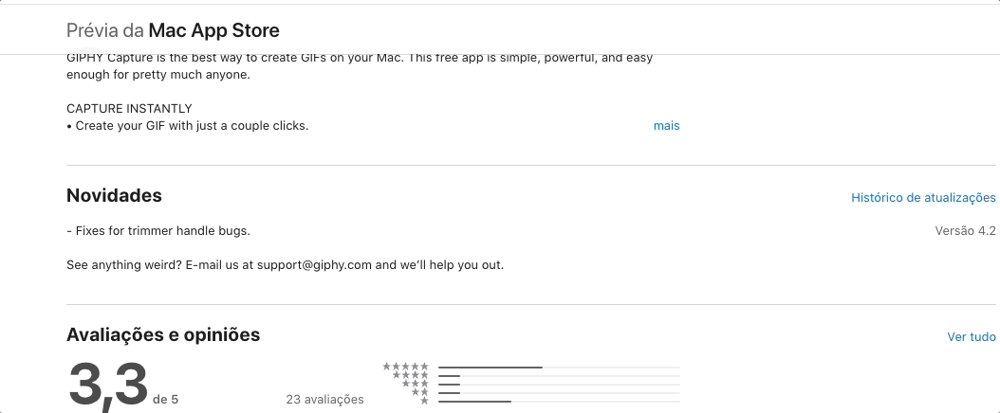

# Projeto com README
Um projeto de teste com um arquivo README

[](https://google.com)

## Tecnologias utilizadas neste projeto
- HTML
- CSS
- JS

## Como utilizar este projeto

1 - Clone o projeto

```
git clone <url>
````

2 - Acesse a pasta do projeto
```
cd repositorio-com-readme
```

